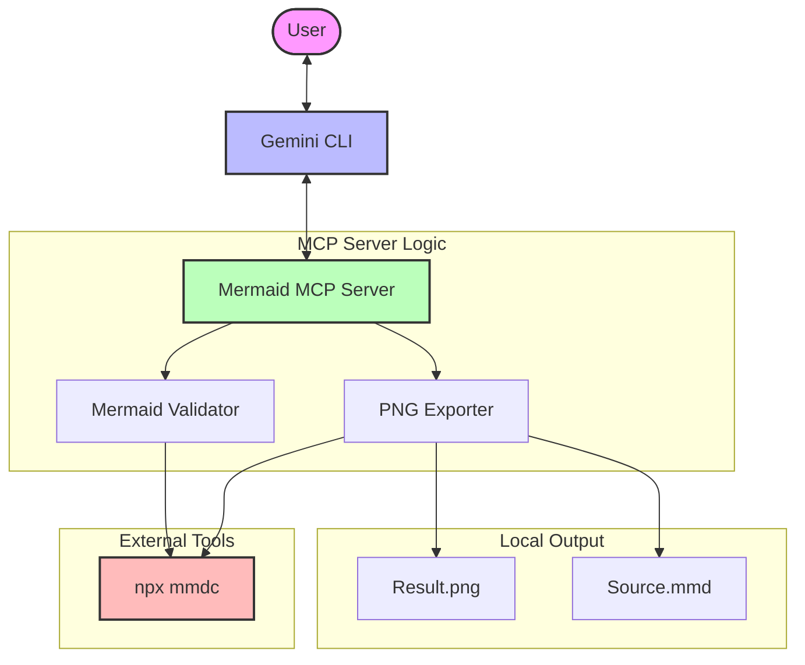

# Mermaid Extension for Gemini CLI 🧜‍♂️📊

[](https://github.com/carlosbarbero/mermaid-extension/actions/workflows/release.yml)

The **Mermaid Extension** is a specialized Gemini CLI tool designed for developers and architects who want to document systems, workflows, and architectures using **Diagrams as Code**. It interprets natural language requirements to generate, validate, and export high-quality Mermaid diagrams directly from your terminal.

## 🚀 Key Features

- **Natural Language to Diagram:** Transform your ideas into valid Mermaid syntax automatically.
- **Dual Export:** Generates both the **PNG** image and the **Mermaid source (.mmd)** file for easy version control.
- **Syntax Validation:** Built-in validation using the official Mermaid CLI to ensure your diagrams are always correct.
- **Support for All Diagram Types:** Flowcharts, Sequence Diagrams, Class Diagrams, ER Diagrams, Gantt Charts, C4 Diagrams, and more.
- **Vibe Coding Experience:** Document your architecture interactively without leaving your development environment.

## 🛠 Architecture

The extension operates as an **MCP (Model Context Protocol) Server**, bridging the gap between Gemini's intelligence and the local filesystem tools.



## 📦 Installation

To install the extension in your Gemini CLI, follow these steps:

1.  **Clone the repository:**
    ```bash
    git clone https://github.com/carlosbarbero/mermaid-extension.git
    cd mermaid-extension
    ```

2.  **Install dependencies and build:**
    ```bash
    npm install
    npm run build
    ```

3.  **Link to Gemini CLI:**
    ```bash
    gemini extensions link .
    ```

4.  **Verify installation:**
    ```bash
    gemini extensions list
    ```

## 💡 Usage Examples

Once installed, you can ask Gemini to create diagrams for you.

### 1. Generating a Flowchart
> "Create a flowchart showing the authentication process: Login -> Check Credentials -> MFA -> Success or Failure."

### 2. Exporting Architecture to PNG
> "Analyze my `src/` folder and create a class diagram of the main components. Save it to `./docs/architecture.png`."

### 3. Manual Tool Usage
The extension exposes two primary tools:
- `validate_mermaid_syntax(code: string)`: Checks if your Mermaid code is valid.
- `export_mermaid_to_png(code: string, outputPath: string)`: Renders the diagram and saves files.

## 📂 Bundled Skills

The extension comes with the **Mermaid Documentation Specialist** skill (`skills/mermaid-documenter/SKILL.md`), which instructs Gemini on:
- Best practices for project analysis (legacy vs. new).
- Selecting the right diagram type for the context.
- Maintaining consistent English documentation.

## 🧪 Development

### Running Tests
```bash
npm test
```

### Linting & Formatting
```bash
npm run lint
npm run format
```

## 📄 License

This project is licensed under the ISC License - see the [LICENSE](LICENSE) file for details.

---
Built with ❤️ by the Gemini CLI Community.
