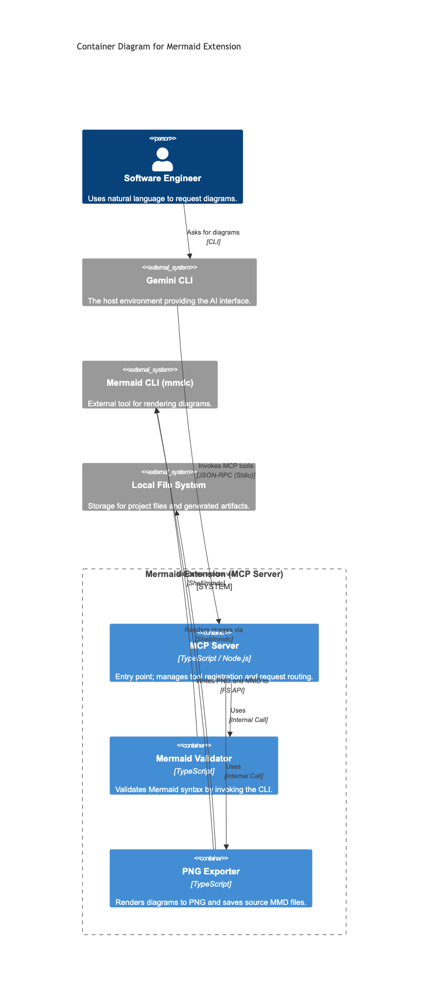

# Mermaid Extension for Gemini CLI 🧜‍♂️📊

[](https://github.com/carlosbarbero/mermaid-extension/actions/workflows/release.yml)

The **Mermaid Extension** is a specialized Gemini CLI tool designed for developers and architects who want to document systems, workflows, and architectures using **Diagrams as Code**. It interprets natural language requirements to generate, validate, and export high-quality Mermaid diagrams directly from your terminal.

## 🎯 Objective

The core problem this extension solves is the friction between architectural design and documentation. Manually creating diagrams often requires external tools outside of the terminal workflow. The Mermaid Extension bridges this gap by:
- **Reducing documentation time:** Transform ideas into visual representations in seconds.
- **Increasing quality & standardization:** Generate valid Mermaid code automatically.
- **Providing a "Vibe Coding" experience:** Document architecture interactively without leaving your development environment.

## 🛠 Architecture (C4 Model)

The extension operates as an **MCP (Model Context Protocol) Server**, providing a standardized interface for Gemini CLI to interact with local rendering tools.



### Core Components:
- **MCP Server (index.ts)**: The entry point that manages tool registration (`validate_mermaid_syntax`, `export_mermaid_to_png`) and routes requests via JSON-RPC (Stdio).
- **Mermaid Validator (validator.ts)**: A TypeScript module that performs syntax checks by invoking the Mermaid CLI (`mmdc`) in a temporary environment.
- **PNG Exporter (exporter.ts)**: Handles the rendering process, ensuring both the **PNG** image and the **Mermaid source (.mmd)** are saved to the local disk.

## 💻 Tech Stack

- **Language:** TypeScript (Strict Mode) for type safety and maintainability.
- **Runtime:** Node.js (ESM - ECMAScript Modules).
- **Protocol:** [@modelcontextprotocol/sdk](https://github.com/modelcontextprotocol/sdk) for tool integration.
- **Rendering Engine:** [@mermaid-js/mermaid-cli](https://github.com/mermaid-js/mermaid-cli) (mmdc).
- **Testing:** Vitest for unit and integration testing.
- **CI/CD:** GitHub Actions for automated building, testing, and multi-platform distribution.

## ✨ Key Features

- **Natural Language to Diagram:** Transform user requirements into valid Mermaid syntax automatically.
- **Dual Export:** Generates both the **PNG** image and the **Mermaid source (.mmd)** file for easy version control.
- **Syntax Validation:** Built-in validation to ensure diagrams are always correct before rendering.
- **Support for All Diagram Types:** Flowcharts, Sequence Diagrams, Class Diagrams, ER Diagrams, C4 Diagrams, Gantt Charts, and more.
- **Specialized Documentation Skill:** Bundled with the **Mermaid Documentation Specialist** skill (`skills/mermaid-documenter/SKILL.md`) for expert architectural insights.

## 📦 Installation

To install the extension in your Gemini CLI:

1.  **Clone the repository:**
    ```bash
    git clone https://github.com/carlosbarbero/mermaid-extension.git
    cd mermaid-extension
    ```

2.  **Install dependencies and build:**
    ```bash
    npm install
    npm run build
    ```

3.  **Link to Gemini CLI:**
    ```bash
    gemini extensions link .
    ```

4.  **Verify installation:**
    ```bash
    gemini extensions list
    ```

## 💡 Usage Guide

Once installed, you can interact with the extension using natural language or by calling its tools directly.

### Natural Language Examples:
- *"Create a flowchart showing the authentication process: Login -> Check Credentials -> MFA -> Success or Failure."*
- *"Analyze my `src/` folder and create a class diagram of the main components. Save it as `architecture.png`."*

### Manual Tool Calls:
- `validate_mermaid_syntax(code: string)`: Checks if your Mermaid code is valid.
- `export_mermaid_to_png(code: string, outputPath: string)`: Renders the diagram and saves files.

## 🧪 Development

### Scripts:
- **Test:** `npm test` (Uses Vitest)
- **Build:** `npm run build` (Uses `tsc`)
- **Lint:** `npm run lint` (Uses ESLint)
- **Format:** `npm run format` (Uses Prettier)

### Automated Releases:
Continuous delivery is handled via GitHub Actions. On every release, the project is packaged and attached to the GitHub Release page as a platform-specific archive.

---
Built with ❤️ by the Gemini CLI Community.
